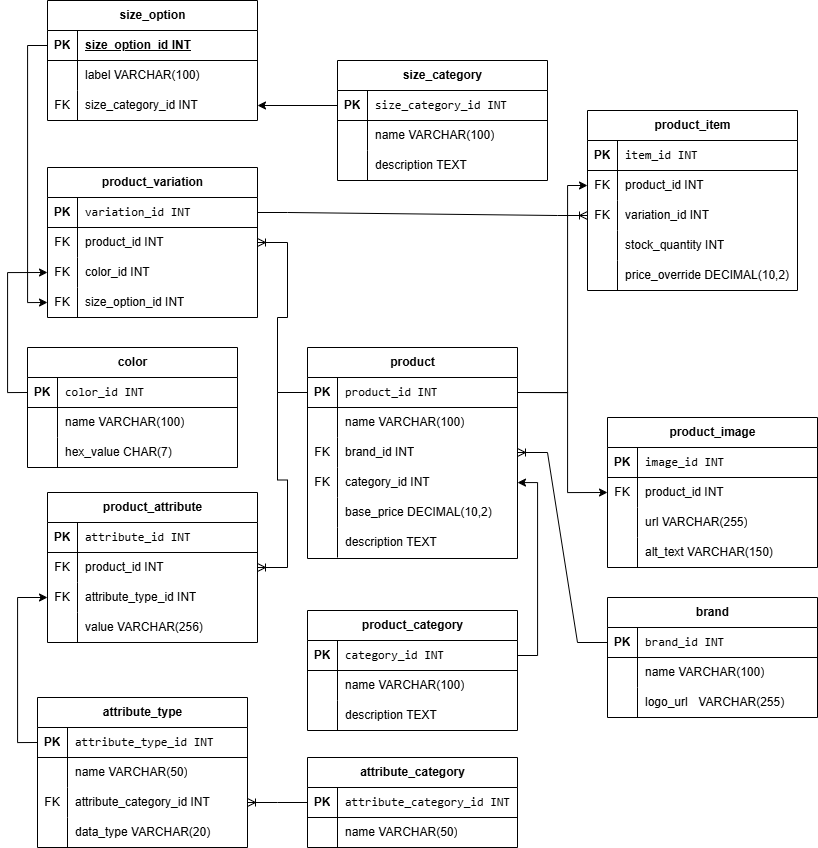

# 🛍️ E-Commerce Product Catalog Database

An advanced, fully normalized (3NF) relational database schema designed for managing products, variations, brands, attributes, and inventory in an e-commerce platform.

---

## 📚 Table of Contents

- [Overview](#overview)
- [Features](#features)
- [ERD](#erd)
- [Database Schema](#database-schema)
- [Entity Relationships](#entity-relationships)
- [Installation & Usage](#installation--usage)
- [Technologies](#technologies)
- [Contributing](#contributing)
- [License](#license)

---

## 📌 Overview

This project defines a modular, scalable MySQL-based database schema for managing an e-commerce platform's product data. The schema supports a robust system for managing brands, categories, images, color/size variations, stock, and product attributes such as specifications and material types.

---

## 🚀 Features

- ✅ Fully normalized (3NF) relational schema
- ✅ Handles multiple product variations (size, color)
- ✅ Dynamic product attributes (tech specs, fabric, etc.)
- ✅ Inventory tracking and price overrides
- ✅ Flexible categorization (size, color, attributes)
- ✅ Supports scalable product listing and filtering

---

## 🧱 ERD

Below is the Entity-Relationship Diagram that shows the connection between all tables in the normalized database schema:



---

## 🧾 Database Schema

The schema includes the following tables:

1. **brand**
2. **product_category**
3. **product**
4. **product_image**
5. **color**
6. **size_category**
7. **size_option**
8. **product_variation**
9. **product_item**
10. **attribute_category**
11. **attribute_type**
12. **product_attribute**

Each table has been designed to follow best practices in relational database design, ensuring referential integrity and normalization.

---

## 🔗 Entity Relationships

- A `product` belongs to a single `brand` and `product_category`.
- Each `product` can have multiple `product_images`.
- `product_variation` connects a `product` with optional `color` and `size_option`.
- `product_item` defines stock levels and price overrides for each `variation`.
- `attribute_type` is categorized by `attribute_category`.
- A `product_attribute` connects a `product` with a specific attribute type and value.

---

## ⚙️ Installation & Usage

### Prerequisites

- MySQL Server (8.0+ recommended)
- SQL client (e.g., MySQL Workbench, DBeaver, or CLI)

### Steps

1. Clone or download this repository.
2. Open your MySQL client and run the provided SQL script:

```sql
SOURCE path/to/ecommercedb.sql;


## 🤝 Collaborators
1. Steve	Asumba
